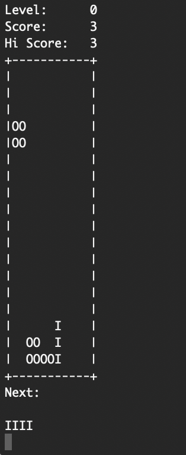

# Quadris

A game of Quadris consists of a board, 11 columns wide and 15 rows high. Blocks consisting of four cells (tetrominoes) appear at the top of the screen, and you must drop them onto the board so as not to leave any gaps. Once an entire row has been filled, it disappears, and the blocks above move down by one unit.

Quadris differs from Tetris in one significant way: it is not real-time. You have as much time as you want to decide where to place a block.

### Execution

Open a shell, go to */bin* and execute the following command:

*./quadris -text*

### Command-line argument

**-text** runs the program in text-only mode. No graphics are displayed. The default behaviour
(no -text) is to show both text and graphics.

**-seed xxx** sets the random number generator’s seed to **xxx**. If you don’t set the seed, you always get the same random sequence every time you run the program. It’s good for testing, but not much fun.

**-scriptfile xxx** Uses **xxx** instead of **sequence.txt** as a source of blocks for level 0.

**-startlevel n** Starts the game in level **n**. The game starts in level 0 if this option is not
supplied.

### Game command

**left** moves the current block one cell to the left. If this is not possible (left edge of the board, or block in the way), the command has no effect.

**right** as above, but to the right.

**down** as above, but one cell downward.

**clockwise** rotates the block 90 degrees clockwise, as described earlier. If the rotation cannot be accomplished without coming into contact with existing blocks, the command has no effect.

**counterclockwise** as above, but counterclockwise.

**drop** drops the current block. It is (in one step) moved downward as far as possible until it comes into contact with either the bottom of the board or a block. This command also triggers the next block to appear. Even if a block is already as far down as it can go (as a result of executing the down command), it still needs to be dropped in order to get the next block.

**levelup** Increases the difficulty level of the game by one. The block showing as next still comes next, but subsequent blocks are generated using the new level. If there is no higher level, this command has no effect.

**leveldown** Decreases the difficulty level of the game by one. The block showing as next still comes next, but subsequent blocks are generated using the new level. If there is no lower level, this command has no effect.

**norandom file** Relevant only during levels 3 and 4, this command makes these levels non-random, instead taking input from the sequence **file**, starting from the beginning. This is to facilitate testing.

**random** Relevant only during levels 3 and 4, this command restores randomness in these levels.

**sequence file** Executes the sequence of commands found in **file**. This is to facilitate the
construction of test cases.

**I, J, L, etc.** Useful during testing, these commands replace the current undropped block with the stated block. Heaviness is detemined by the level number. Note that, for heavy blocks, these commands do not cause a downward move.

**restart** Clears the board and starts a new game.

**hint** Suggests a landing place for the current block. The game should suggest the best place to put the current block (spend some time thinking about what “best” might mean), but it must not suggest a position that is not legally reachable (for example, any position that cannot be reached without moving the block upwards). The hint should be indicated on the text display by a block made of ?’s in the suggested position, and in the graphics display using the colour black. On the very next command, no matter what the command is, the hint must disappear from the displays.

### Level

**Level 0:** Takes its blocks in sequence from the file sequence.txt (a sample is provided), or from another file, whose name is supplied on the command line. This level is non-random, and can be used to test with a predetermined set of blocks.

**Level 1:** The block selector will randomly choose a block with probabilities skewed such that S and Z blocks are selected with probability 1/12 each, and the other blocks are selected with probability 1/6 each.

**Level 2:** All blocks are selected with equal probability.

**Level 3:** The block selector will randomly choose a block with probabilities skewed such that S and Z blocks are selected with probability 2/9 each, and the other blocks are selected with probability 1/9 each. Moreover, blocks generated in level 3 are “heavy”: every command to move or rotate the block will be followed immediately and automatically by a downward move of one row (if possible).

**Level 4:** In addition to the rules of Level 3, in Level 4 there is an external constructive force: every time you place 5 (and also 10, 15, etc.) blocks without clearing at least one row, a 1x1 block (indicated by * in text, and by the colour brown in graphics) is dropped onto your game board in the centre column. Once dropped, it acts like any other block: if it completes a row, the row disappears. So if you do not act quickly, these blocks will work to eventually split your screen in two, making the game difficult to play.

